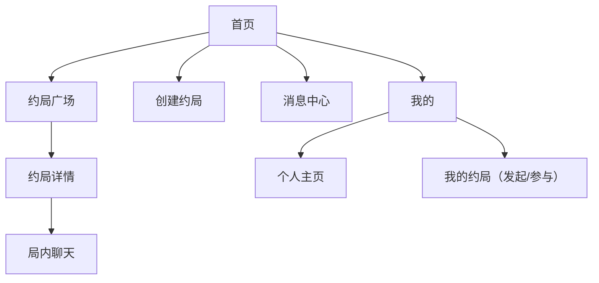
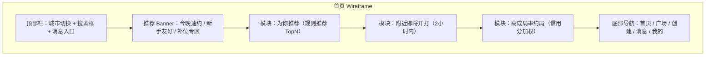
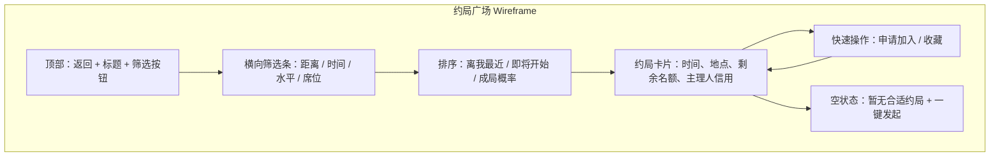
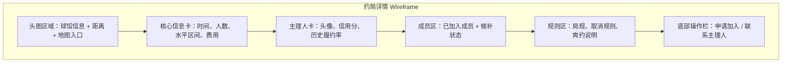
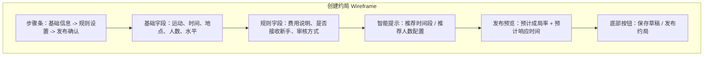
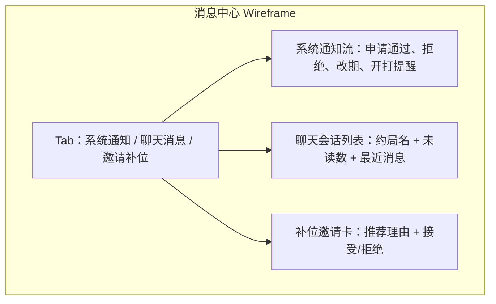
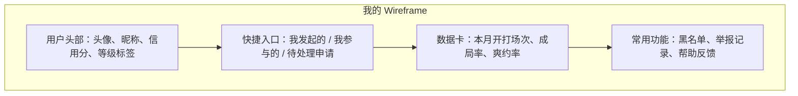
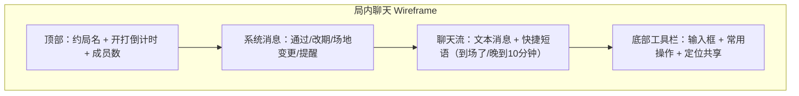

# 约球 Web 页面设计图（方案 B / 移动端优先）

## 1. 设计基调
- 定位：运动感、轻竞技、可信赖
- 视觉关键词：速度、附近、成局率
- 颜色建议：
  - 主色：活力橙 `#FF6A3D`
  - 辅色：深海军蓝 `#0F1C2E`
  - 成功色：草地绿 `#2FBF71`
  - 警示色：琥珀黄 `#F5A623`
- 字体建议：`Noto Sans SC`（移动端可读性优先）

## 2. 信息架构图

## 3. 首页（推荐约局）

## 4. 约局广场（筛选 + 列表）

## 5. 约局详情页（申请与决策）

## 6. 创建约局页（1 分钟发局）

## 7. 消息中心（高优先级触达）

## 8. 我的页（信誉与复约）

## 9. 局内聊天页（开打协同）

## 10. 页面状态规范（全局）
- 加载态：骨架屏（列表卡 + 按钮占位）
- 空态：展示“推荐替代时间/附近球馆/发起新局”
- 错误态：弱网重试 + 客服入口
- 风险态：信用分过低用户展示风险提示

## 11. 交互节奏建议
- 首页首屏动画：卡片 120ms 级联浮入
- 申请加入反馈：按钮态即时变化（申请中 -> 待审核）
- 开打提醒：倒计时颜色从中性到警示渐变

